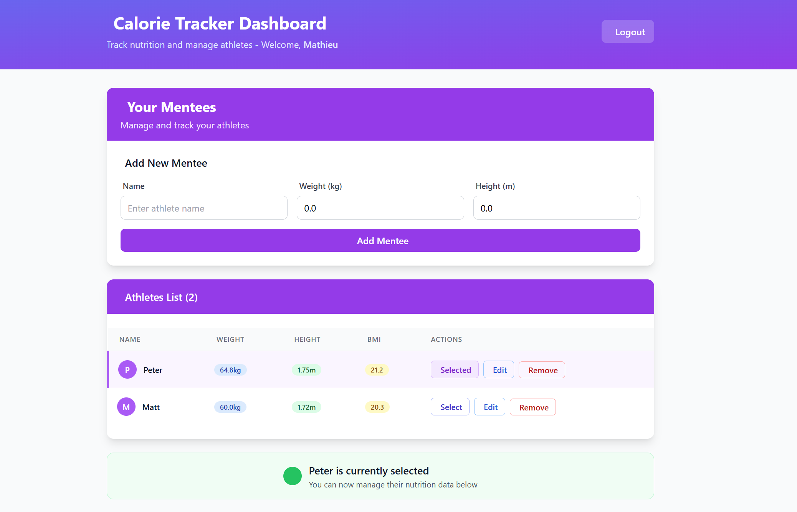
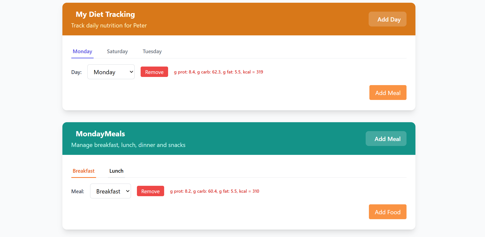
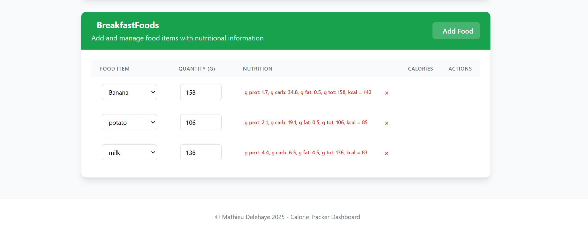
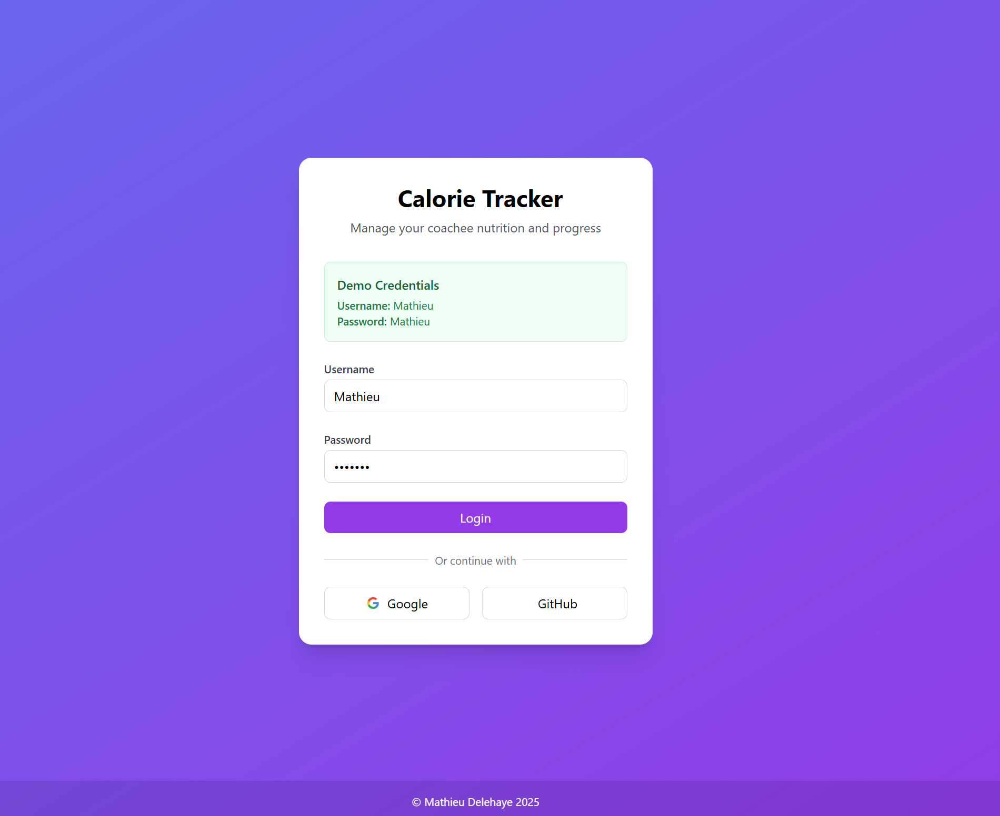
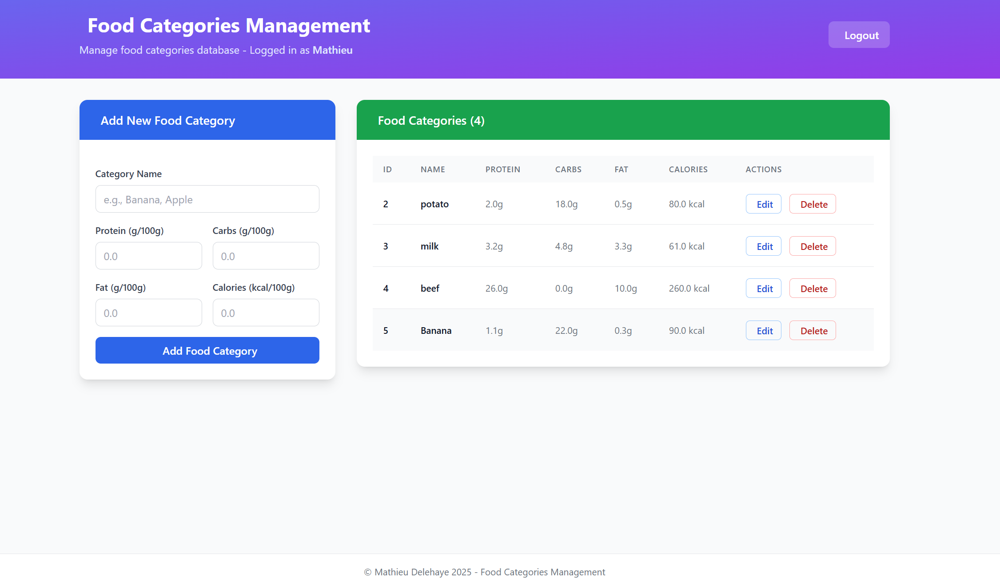
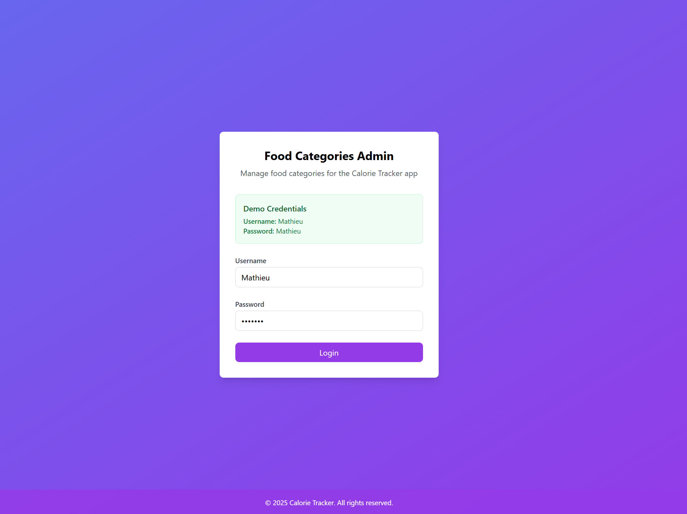

# 🏋️‍♂️ Calorie Tracker - Microservices Application

## 🌐 Live Applications

- **[Calorie Tracker App](https://calorie-tracker-app.wittyflower-c2822a5a.eastus.azurecontainerapps.io)** - Main application for managing athletes' nutrition
- **Food Categories Admin** - Administrative interface for food categories *(Currently under testing)*

## 📸 Screenshots

  
  

  
  

  
  

## 🚀 Features

- **Multi-User Support**: Coaches can manage multiple athletes
- **Food Category Management**: Centralized food category administration
- **Meal Planning**: Comprehensive meal and nutrition tracking
- **Real-Time Updates**: Immediate data synchronization
- **Responsive Design**: Mobile-friendly interface using Tailwind CSS

## 🛠️ Tech Stack

### Backend
- **Java 17** with Spring Boot 3.2
- **PostgreSQL** databases hosted on Neon.tech
- **Spring Security** for authentication
- **Spring Data JPA** for data persistence
- **Gradle** for build automation
- **JUnit 5** & **Spring Test** for comprehensive testing
  - Integration tests
  - Repository tests
  - Controller tests
  - Service layer tests

### Frontend
- **Thymeleaf** templating engine
- **Tailwind CSS** for modern UI
- **JavaScript** for interactive features
- **HTML5** & modern web standards

### Infrastructure
- **Docker** containers for consistent deployment
- **Azure Container Apps** for cloud hosting
- **Azure Container Registry** for image management
- **Microservices Architecture** for scalability
- **GitHub Actions** for CI/CD (planned)

## 🏗️ Architecture

This project implements a modern microservices architecture:

1. **Calorie Tracker App (Main Service)**
   - Handles athlete management
   - Manages meal planning
   - Processes nutritional calculations
   - Connects to primary database

2. **Food Categories Admin (Admin Service)**
   - Manages food category definitions
   - Provides administrative interface
   - Maintains food category database
   - Cross-database communication

### Infrastructure Benefits
- **Scalability**: Each service can scale independently
- **Resilience**: Services operate independently
- **Maintainability**: Smaller, focused codebases
- **Deployment Flexibility**: Independent deployment cycles

## 🔄 Deployment Process

1. **Containerization**
   - Each service has its own Dockerfile
   - Images built and pushed to Azure Container Registry

2. **Cloud Deployment**
   - Azure Container Apps for orchestration
   - Automatic scaling based on load
   - External ingress configuration
   - Secure secret management

3. **Database Management**
   - Separate databases for different concerns
   - Cross-database queries when needed
   - Managed by Neon.tech for reliability

## 📝 TODO List

### Immediate Plans
- Implement Event-Driven Architecture (EDA) using Kafka
  - Service synchronization
  - Real-time updates
  - Event sourcing
  - Message queuing

### Future Enhancements
- Add Terraform for Infrastructure as Code (IaC)
  - Automated infrastructure provisioning
  - Version-controlled infrastructure
  - Consistent environments
  - Simplified deployment process
- Enhance monitoring and observability
- Implement caching layer
- Add comprehensive test coverage
- Set up automated performance testing

## 🤝 Contributing

Contributions are welcome! Please feel free to submit a Pull Request.

## 📄 License

This project is licensed under the GNU Affero General Public License v3.0 (AGPL-3.0) - see the [LICENSE](LICENSE) file for details. This license ensures that any modifications or derivative works must also be open source and share-alike.

## 🔍 Quality Assurance

### Testing Infrastructure
- **JUnit 5** test framework
- **Spring Test** for integration testing
- **MockMvc** for controller testing
- **TestContainers** for database testing
- Comprehensive test coverage across:
  - Controllers
  - Services
  - Repositories
  - Integration scenarios

### Test Categories
1. **Unit Tests**
   - Service layer business logic
   - Controller request handling
   - Data transformations
   - Utility functions

2. **Integration Tests**
   - Database operations
   - Cross-service communication
   - Security configurations
   - API endpoints

3. **Repository Tests**
   - Data persistence
   - Query operations
   - Transaction management
   - Database constraints 